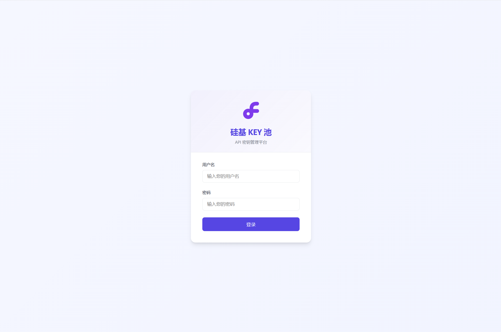

# 硅基 KEY 池

一个用于管理 SiliconFlow API 密钥的本地工具。支持批量导入 API 密钥、余额检查、请求转发和负载均衡。

## 功能特点

- 批量导入和管理 API 密钥
- 自动检查密钥余额和有效性
- 随机选择密钥转发请求，实现负载均衡
- 完整的管理界面，包括密钥管理和使用日志
- 支持流式响应

## 使用方法

1. 安装依赖：
   ```bash
   pip install -r requirements.txt
   ```

2. 运行服务：
   ```bash
   python main.py
   ```

3. 访问管理面板：http://127.0.0.1:7898
   - 默认用户名和密码在 config.py 中设置

4. 导入您的 API 密钥

5. 在您的应用中设置：
   - OpenAI API 基础 URL：`http://127.0.0.1:7898`
   - API 密钥：任意值（密钥池会自动选择可用密钥）

## Docker 部署

### 使用预构建镜像

项目提供了预构建的Docker镜像，可以直接使用以下命令运行：

```bash
docker run --platform linux/amd64 -d \
  --name siliconflow \
  -p 7898:7898 \
  -v $(pwd)/data:/app/data \
  -e API_KEY=your_api_key \
  -e ADMIN_USERNAME=admin \
  -e ADMIN_PASSWORD=password \
  -e AUTO_REFRESH_INTERVAL=3600 \
  grgk0604/siliconflow-python:latest
```

### 环境变量

通过以下环境变量配置应用：

- `API_KEY`: 可选，设置API访问密钥
- `ADMIN_USERNAME`: 管理员用户名（默认为配置文件中的值）
- `ADMIN_PASSWORD`: 管理员密码（默认为配置文件中的值）
- `AUTO_REFRESH_INTERVAL`: API密钥余额自动刷新间隔（秒），默认为3600秒（1小时），设置为0禁用自动刷新

### 数据持久化

为确保数据持久化，将数据目录挂载到主机：

```bash
-v /path/to/local/data:/app/data
```

### 使用Docker Compose

```yaml
version: '3'

services:
  siliconflow:
    image: grgk0604/siliconflow-python:latest
    platform: linux/amd64
    container_name: siliconflow
    restart: unless-stopped
    ports:
      - "7898:7898"
    volumes:
      - ./data:/app/data
    environment:
      - API_KEY=your_api_key
      - ADMIN_USERNAME=admin
      - ADMIN_PASSWORD=password
      - AUTO_REFRESH_INTERVAL=3600
```

将以上内容保存为`docker-compose.yml`文件，然后运行：

```bash
docker-compose up -d
```

服务将在 http://localhost:7898 上可用。

## 示例
- 登录页

- 管理页

- 密钥页


## 注意事项

- 请保护好生成的 `data/pool.db` 文件，它包含您的所有 API 密钥！
- 系统会自动清理无效或余额为零的密钥
- 系统会根据配置的时间间隔自动刷新所有API密钥的余额（可通过AUTO_REFRESH_INTERVAL环境变量设置，默认每小时一次）
- 登录会话有效期为 24 小时
- 容器升级时请确保正确挂载 `/app/data` 目录，否则密钥数据会丢失

## 数据迁移指南

如果您之前使用的是旧版本（数据库文件存储在根目录），请按以下步骤迁移数据：

1. 停止当前运行的容器：
   ```bash
   docker-compose down
   ```

2. 创建数据目录（如果不存在）：
   ```bash
   mkdir -p data
   ```

3. 如果您有现有的 `pool.db` 文件，将其复制到 data 目录中：
   ```bash
   cp pool.db data/
   ```

4. 使用新的 docker-compose.yml 启动容器：
   ```bash
   docker-compose up -d
   ```

5. 验证数据是否成功迁移：
   访问管理面板并检查您的密钥是否正确显示。
