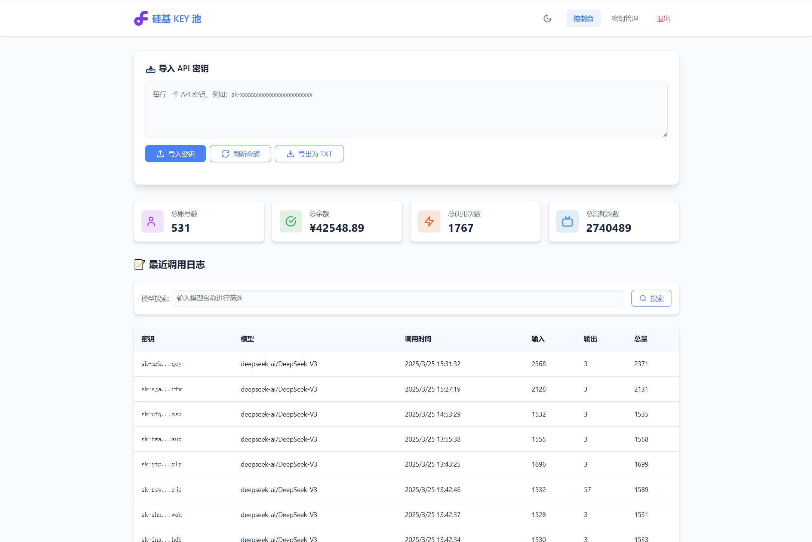

# 硅基 KEY 池 (Siliconflow Key Pool)

一个用于管理 SiliconFlow API 密钥的高性能服务，支持MySQL数据库，提供API代理、密钥管理和监控功能。

## 功能特点

- 🔑 批量导入和管理 API 密钥，自动检查余额和有效性
- 🔄 智能负载均衡：随机选择密钥转发请求，实现负载分散
- 📊 详细的使用统计和日志记录，支持Token计数和模型分析
- 🛡️ 安全的管理界面，包含密钥管理、日志查看和系统配置
- 🌊 完全支持流式响应，兼容各类对话应用
- 📈 系统监控：提供健康检查和指标统计API
- 🗄️ 支持MySQL数据库，提供更好的性能和并发支持

## 系统要求

- Python 3.8 或更高版本
- MySQL 5.7 或更高版本 (也支持SQLite模式)

## 快速开始

### 安装

1. 克隆代码库并进入项目目录
```bash
git clone https://github.com/grgk0604/Siliconfig-Python.git
cd Siliconfig-Python
```

2. 安装依赖
```bash
pip install -r requirements.txt
```

3. 配置数据库
编辑 `db_config.py` 文件，配置MySQL连接参数：
```python
# 数据库类型: 'mysql' 或 'sqlite'
DB_TYPE = 'mysql'

# MySQL 配置
MYSQL_CONFIG = {
    'host': 'localhost',
    'port': 3306,
    'user': 'root',
    'password': 'your_password',
    'database': 'siliconflow',
    'charset': 'utf8mb4',
    'pool_size': 10,
    'max_overflow': 20,
    'pool_timeout': 30,
    'pool_recycle': 3600,
}
```

4. 配置管理员账户
编辑 `config.py` 文件，设置管理员账户和密码：
```python
API_KEY = "your_api_key"  # 可选的API访问密钥
ADMIN_USERNAME = "admin"  # 管理员用户名
ADMIN_PASSWORD = "your_password"  # 管理员密码
```

5. 运行服务器
```bash
python main.py
```

服务器将在 `http://0.0.0.0:7898` 上运行。

### 从SQLite迁移到MySQL

如果您之前使用的是SQLite版本，可以使用迁移工具将数据迁移到MySQL：

```bash
python migrate_sqlite_to_mysql.py
```

确保在运行迁移前已经正确配置了 `db_config.py` 中的MySQL数据库连接信息。

## API端点

### OpenAI兼容API

- `POST /v1/chat/completions` - 聊天完成API，兼容OpenAI格式
- `POST /v1/embeddings` - 嵌入API，兼容OpenAI格式
- `GET /v1/models` - 获取可用模型列表

### 管理API

- `GET /health` - 健康检查
- `GET /metrics` - 获取系统指标 (需要认证)
- `GET /stats` - 获取基础统计信息 (需要认证)
- `POST /import_keys` - 导入API密钥 (需要认证)
- `POST /refresh` - 刷新所有API密钥 (需要认证)
- `GET /export_keys` - 导出所有API密钥 (需要认证)
- `GET /logs` - 获取使用日志 (需要认证)
- `POST /clear_logs` - 清空日志 (需要认证)
- `GET /api/keys` - 分页获取API密钥列表 (需要认证)
- `POST /api/refresh_key` - 刷新单个API密钥 (需要认证)
- `GET /api/key_info` - 获取单个API密钥信息 (需要认证)
- `GET /log_cleanup_config` - 获取日志清理配置 (需要认证)
- `POST /log_cleanup_config` - 更新日志清理配置 (需要认证)

## 管理界面

访问 `http://localhost:7898` 并使用在 `config.py` 中配置的管理员用户名和密码登录。

管理界面功能：
- 导入和管理API密钥
- 查看使用统计和日志
- 刷新API密钥余额
- 管理日志清理配置

### 界面预览

- 登录页

- 管理页

- 密钥页


## 配置说明

### 日志清理配置

可以通过管理界面或直接编辑 `db_config.py` 配置日志清理选项：

```python
# 日志清理配置
LOG_AUTO_CLEAN = True  # 是否启用自动清理日志
LOG_RETENTION_DAYS = 30  # 保留最近30天的日志
LOG_CLEAN_INTERVAL_HOURS = 24  # 每24小时清理一次
LOG_BACKUP_ENABLED = False  # 是否在清理前备份日志
LOG_BACKUP_DIR = "log_backups"  # 日志备份目录
```

## 部署方式

### Docker 部署

提供了 Dockerfile 和 docker-compose.yml 文件，方便快速部署：

```bash
# 构建镜像
docker build -t siliconfig-python .

# 使用 docker-compose 启动
docker-compose up -d
```

#### 连接外部MySQL数据库

如果需要连接外部MySQL数据库，可以直接修改`docker-compose.yml`中的环境变量：

```yaml
environment:
  - TZ=Asia/Shanghai
  - MYSQL_HOST=your_mysql_host    # 更改为您的MySQL主机地址
  - MYSQL_PORT=3306               # 更改为您的MySQL端口
  - MYSQL_USER=your_mysql_user    # 更改为您的MySQL用户名
  - MYSQL_PASSWORD=your_password  # 更改为您的MySQL密码
  - MYSQL_DATABASE=siliconfig     # 更改为您的数据库名称
```

确保您的外部MySQL服务器已经准备好相应的数据库，应用程序会在首次启动时自动创建所需的表结构。

### Supervisor 部署

在生产环境中，建议使用 Supervisor 管理服务：

1. 安装 Supervisor
```bash
pip install supervisor
```

2. 创建配置文件 `/etc/supervisor/conf.d/siliconfig.conf`：
```
[program:siliconfig]
command=python /path/to/Siliconfig-Python/main.py
directory=/path/to/Siliconfig-Python
user=www-data
autostart=true
autorestart=true
redirect_stderr=true
stdout_logfile=/var/log/siliconfig.log
```

3. 重新加载 supervisor 并启动服务
```bash
supervisorctl reread
supervisorctl update
supervisorctl start siliconfig
```

## 安全建议

1. 使用反向代理：在生产环境中，建议使用 Nginx 或 Apache 作为反向代理，并配置 HTTPS。

2. 防火墙设置：限制 IP 访问管理界面。

3. API 密钥保护：确保 `config.py` 中的 API_KEY 设置为复杂密码，以保护管理 API 接口。

4. 定期备份：建议定期备份数据库，特别是在使用 SQLite 模式时。

5. 日志监控：定期检查日志，关注可疑活动。

## 贡献指南

欢迎提交 Pull Requests 或 Issues 来改进项目。在提交代码前，请确保：

1. 代码遵循 PEP 8 规范
2. 所有测试通过
3. 新功能包含适当的测试
4. 更新相关文档

## 许可证

MIT License

## 联系方式

如有问题或建议，请联系：
- 项目维护者：[GRGK0604](mailto:grgk0604@163.com)
- 问题反馈：[GitHub Issues](https://github.com/GRGK0604/Siliconflow-Python/issues)
